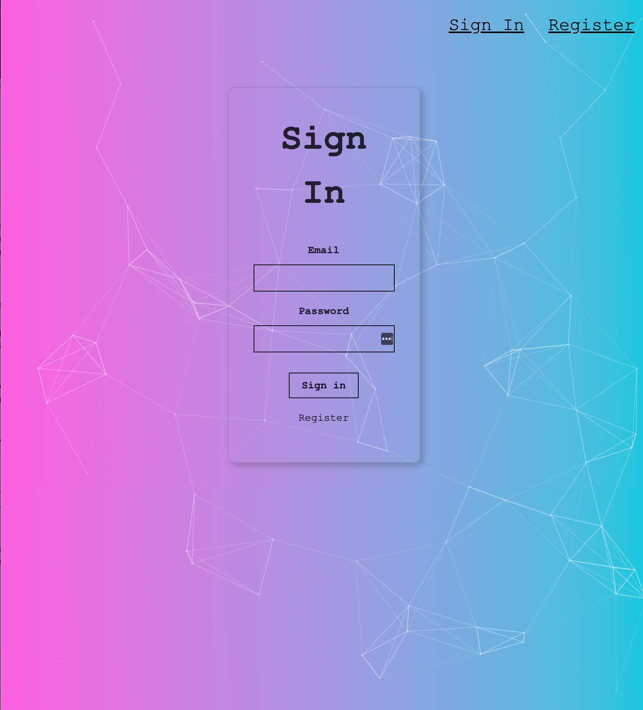
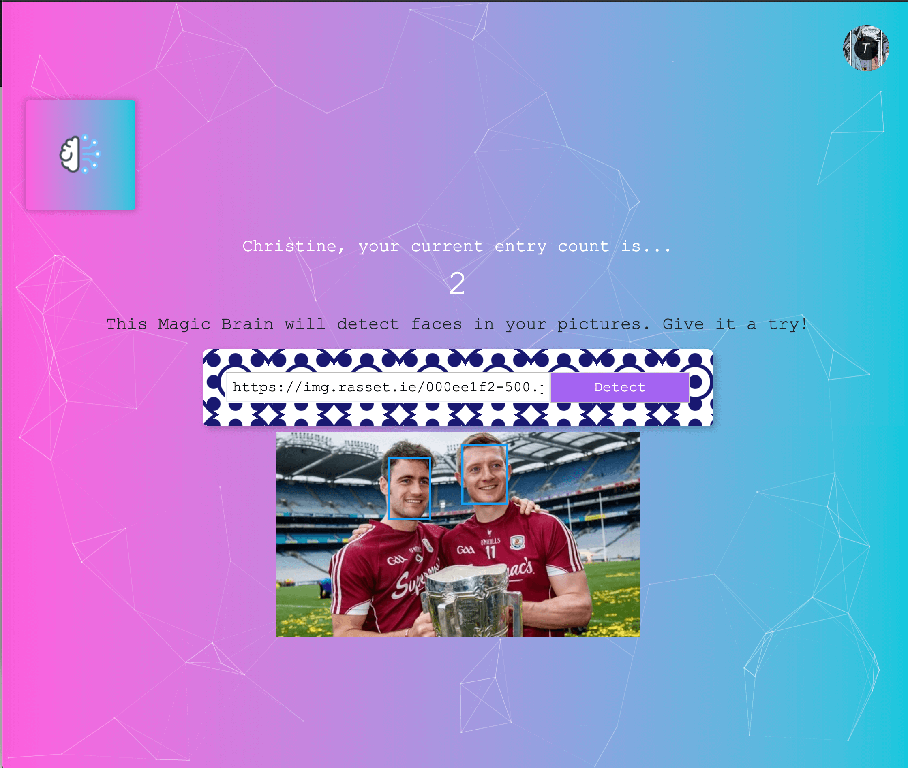

Face Recognition app takes a photo as input and uses the Clarifai face detection API to detect and highlight faces.
It also keeps a record of users login details, hash encrypted passwords and how many photos they have used the API with.

Login page

Face Recognition

## Available Scripts

In the project directory, you can run:

### `yarn start`

Runs the app in the development mode. 
Open [http://localhost:3000](http://localhost:3000) to view it in the browser.
g